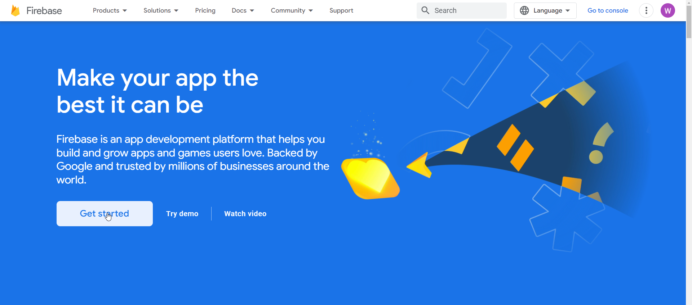
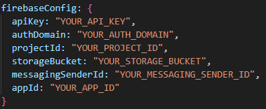
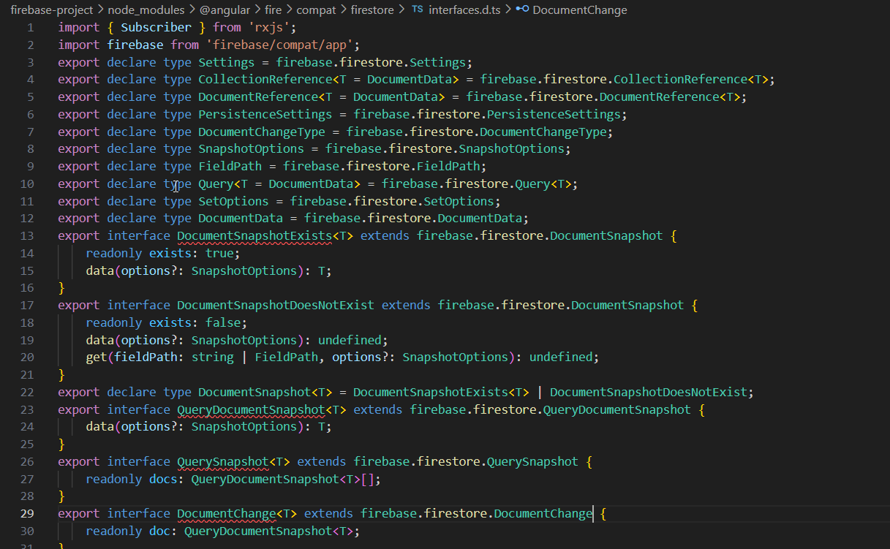
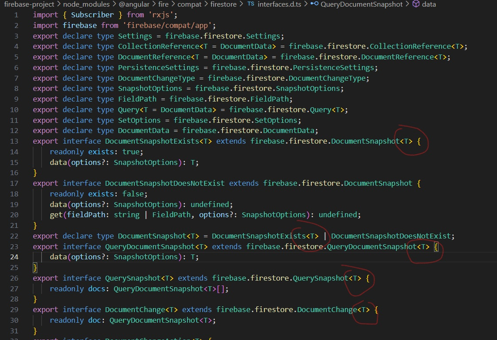

# Firebase E-Portfolio
https://firebase.google.com/
# Table of Contents
- [Installation](#1-installation)
- [Creating-a-firebase-project](#2-creating-a-firebase-project)
    - [Start](#21-start)
    - [Authentication](#22-authentication)
    - [Firestore](#23-firestore)
    - [Firestorage](#24-firestorage)
    - [Hosting](#25-hosting)
- [Common-Error](#3-common-error)
- [Tutorials-and-Links](#4-tutorials-and-links)
---
## 1. Installation
For this e-portfolio you will need:

- [Node.js](https://nodejs.org/en)
- [Gmail Account](https://www.google.com/intl/de/gmail/about/)
- [This Repository](https://github.com/willizielke/firebase-project)

After you have installed Node.js, created a Gmail Account and cloned this repository to your IDE, you have to install angular cli with the command "npm install -g @angular/cli".   
After that you have to install the node_modules with the "npm install" command.   
Then you should be able to start the application with "ng serve" or "npm start".    
If you happen to get an error, you should check if you have truly installed Node.js with the "node -v" command and if you truly have installed the node_modules (there should be a folder with "node_modules").  
 If you cloned this repository after the presentation, you may be getting this error: [Common-Error](#3-common-error).
 

---
## 2. Creating a firebase-project
 

### 2.1 Start

For the start you need to login to <a href="https://firebase.google.com/">Firebase</a>.

Then you click at the "Get started"-button. It should look like this:  
After that you should click at the "create a project"-button and follow the instructions.   
After you created your project, you can choose what type of application you want... in this example we will use a web-app.   
Click at the "web"-button(see in the picture below) to create firebase for your app and follow the instructions.

You should copy your "firebaseConfig": it should look like this:    
and add it to your <a href="https://github.com/willizielke/firebase-project/blob/main/firebase-project/src/app/environments/environment.ts">environment.ts</a>.  
Then you can add Authentication, Firestore and Firestorage to your project.

 

### 2.2 Authentication

Now you go to Authentication and click the "Get started"-button.

In the "Sign-in method"-tab you can now choose how your users can login to your website.  
In our example we use only Google as Sign-in method.
Now you are ready to implement it into your application.  
In the repository in the commit authentication you will see how it works for a angular-project.

### 2.3 Firestore

Now you go to Firestore and click the "Create database"-button.

We use "Start in production mode" and choose multiregional "eur3 (Europe)".  
After we created our database we create a collection with the Collection ID "items" and create a random document.  
In the "Rules"-tab you can now manage your security rules.  
In our example, you can find the rules in the <a href="https://github.com/willizielke/firebase-project/tree/main/firebase-project/src/app/components/firestore">Firestore-Component</a>.  
You need to copy them and replace them in the "Rules"-tab.
Now you are ready to implement it into your application.  
In the repository in the commit firestore you will see how it works for a angular-project.

### 2.4 Firestorage

Now you go to Storage and click the "Get started"-button.  

We use "Start in production mode" and choose multiregional "eur3 (Europe)".  
After we created our storage, you can now manage your security rules in the "Rules"-tab.  
In our example, you can find the rules in the <a href="https://github.com/willizielke/firebase-project/tree/main/firebase-project/src/app/components/firestorage">Firestorage-Component</a>.  
You need to copy them and replace them in the "Rules"-tab.
Now you are ready to implement it into your application.  
In the repository in the commit firestorage you will see how it works for a angular-project.

### 2.5 Hosting

Before you can host your website you need first to make a build, in our example you do it with the command "ng build".  

Now you go to Hosting in the Firebase and click the "Get started"-button.  
You need to install the firebase tools with the command "npm install -g firebase-tools".  
After that you need to login to your firebase account with the command "firebase login" and then setup your project with the command "firebase init".  
There you need to choose your project, hosting, and the build folder, in our example the dist/project folder.  
With the command "firebase deploy" you can now access your application in your given domains(see in Firebase in Hosting).

---
## 3. Common Error
 

from

to

---
## 4. Tutorials and Links
 

- [Firebase Documentation](https://firebase.google.com/docs/?hl=de&authuser=0&_gl=1*1hqw1ap*_ga*OTcxMzMyNzc5LjE2NzY0NjkxMTE.*_ga_CW55HF8NVT*MTY4NjY5MjE2Mi42MS4xLjE2ODY2OTYwNDMuMC4wLjA.)
- [LinkedInLearning-Course](https://www.linkedin.com/learning/firebase-essential-training/)
